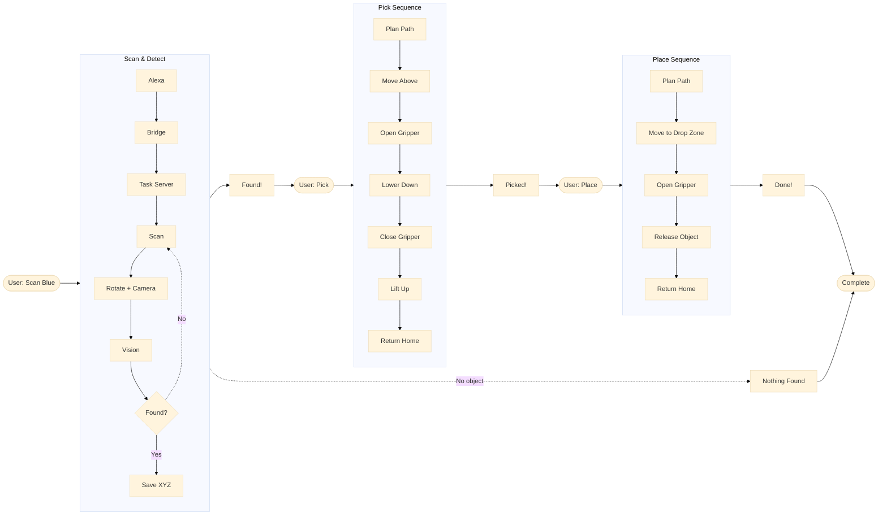

# ArduinoBot Project - Complete System Flowchart

---

## How to View This Diagram

### In VS Code:
1. Install "Markdown Preview Mermaid Support" extension
2. Open this file and press `Ctrl+Shift+V` (preview)

### Online:
Copy the diagram and paste at: https://mermaid.live/

### Export as Image:
Use Mermaid Live Editor to export as PNG/SVG

---

## Simple Explanation

**What this shows:** The complete journey from voice command to finished task.

1. **User speaks** to Alexa ("Scan for blue")
2. **Alexa** sends command through Flask bridge
3. **Task Server** (the brain) coordinates everything
4. **Camera** looks around while arm rotates
5. **Vision** finds the blue object and saves location
6. **Alexa** confirms "Found blue!"
7. **User** says "Pick it"
8. **MoveIt** plans safe path to object
9. **Robot** moves, grabs, lifts, returns home
10. **User** says "Place it"
11. **Robot** moves to drop zone and releases
12. **Done!**

**Key Parts:**
- **Rounded boxes** = User interaction
- **Rectangle boxes** = System processes
- **Diamond shapes** = Decision points

